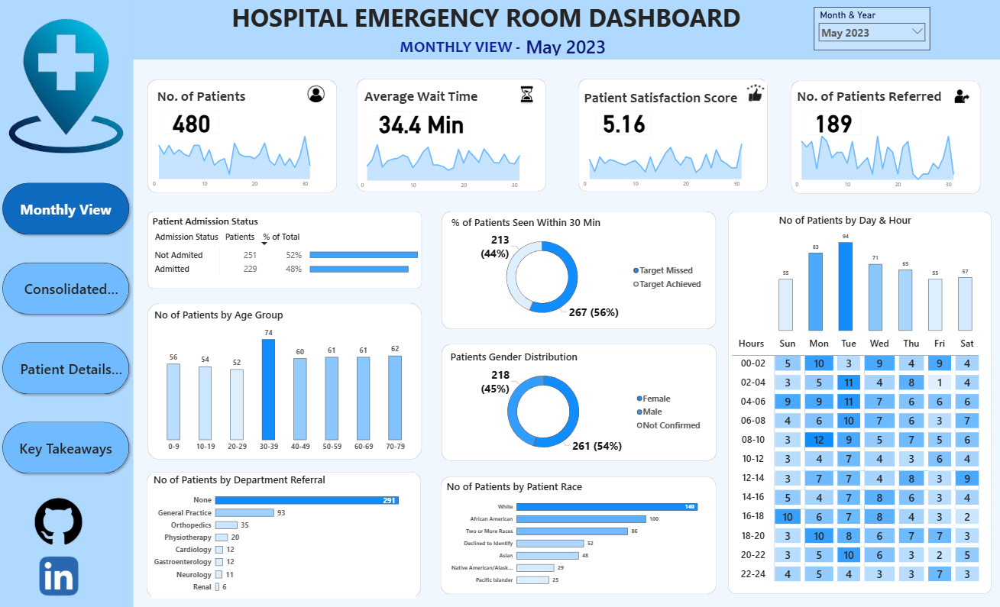
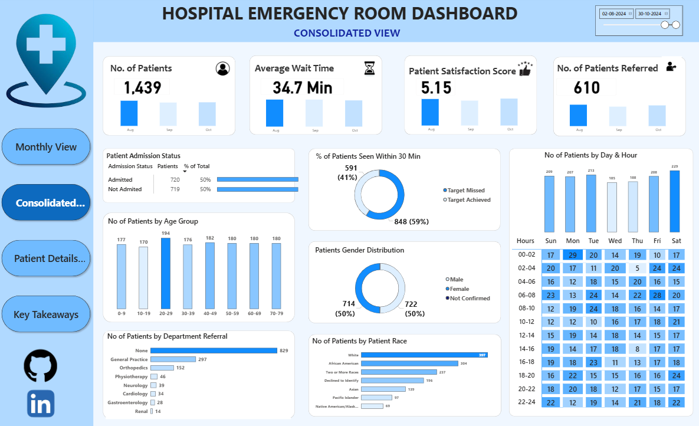
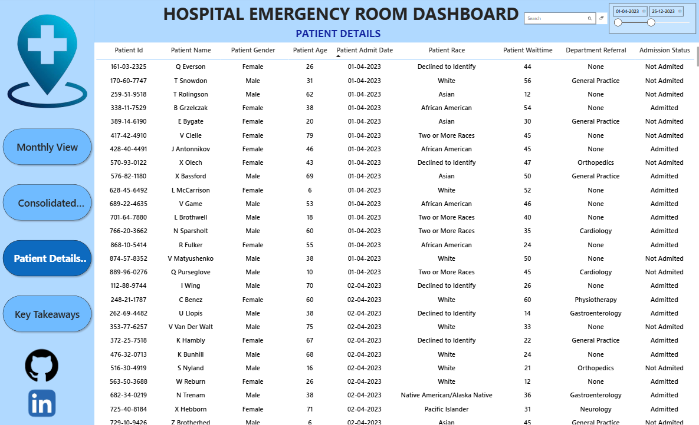
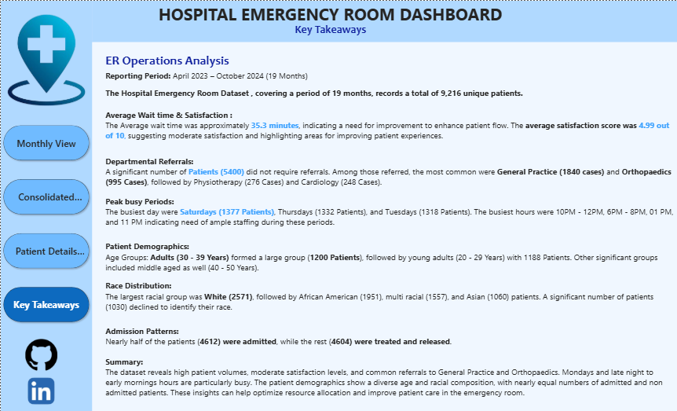

<div align="center">

# Hospital ER Analytics Dashboard Report

### A Power BI Analytics Solution for Emergency Room Performance Optimization

</div>

---

## Table of Contents
1. [Introduction](#1-introduction)
2. [Problem Statement](#2-problem-statement)
3. [Objective](#3-objective)
4. [Development Process](#4-development-process)
5. [Data Preprocessing](#5-data-preprocessing)
6. [Use Cases](#6-use-cases)
7. [Key Visualizations and Insights](#7-key-visualizations-and-insights)
8. [Requirements](#8-requirements)
9. [Installation](#9-installation)
10. [Conclusion](#10-conclusion)

---

## 1. Introduction
This report presents the Hospital Emergency Room (ER) Analytics Dashboard developed using Power BI, aimed at providing comprehensive insights into emergency department operations and patient flow. The dashboard showcases key operational metrics based on a dataset of **9,216 patient visits**, including total patient volume (9,216), hospital admission rate (50.0%), average patient age (39.9 years), average wait time (35.3 minutes), average patient satisfaction score (4.99 / 10), and total departmental referrals (3,816).

---

## 2. Problem Statement
Hospital emergency departments face critical operational challenges, including unpredictable patient surges, prolonged wait times, and imbalanced departmental workloads. With **59.3% of patients waiting over 30 minutes** before receiving care and an average satisfaction score of 4.99 out of 10, there is a clear need to analyze patient flow and bottlenecks. Without centralized analytics, hospital management cannot effectively allocate staff or optimize triage processes to improve clinical outcomes and patient experience.

---

## 3. Objective
To analyze emergency room patient flow, wait time patterns, and referral distributions to identify key operational bottlenecks. The ultimate goal is to provide hospital leadership with data-driven strategies to reduce patient wait times, optimize staffing schedules, balance departmental referral loads, and improve overall patient satisfaction.

---

## 4. Development Process
The development process began with the ingestion of raw ER operational records from hospital HR and management systems, encompassing patient demographics, admission flags, wait times, satisfaction scores, and department referrals across 9,216 records. This data was meticulously cleaned and standardized. Following this, a robust dimensional data model was created in Power BI, incorporating a dedicated DAX Date Table and establishing precise relationships to enable seamless cross-filtering and time-intelligence analysis.

---

## 5. Data Preprocessing
I prepared the raw hospital data for analysis using Power Query (M language) and DAX. This involved handling null values in patient satisfaction scores, creating calculated columns for date normalization (`Admission Date (Date Only)`), and generating composite fields such as `Patient Full Name`. Furthermore, I engineered advanced operational categories, including `Admission Status` (Admitted vs. Not Admitted) and `Wait Time Status` (Target Achieved [< 30 min] vs. Target Missed [> 30 min]). By diligently addressing these data structure and formatting needs, I established a solid, reliable foundation for extracting meaningful clinical and operational insights.

---

## 6. Use Cases

| **Use Case** | **Description** | **Outcome** |
|---|---|---|
| **Staffing & Capacity Planning** | Analyze patient volume trends by day and hour to identify peak ER rush times. | Optimized shift scheduling, reduced staff burnout, and minimized patient bottlenecks. |
| **Wait Time & Triage Optimization** | Track patients missing the 30-minute wait time target to streamline triage workflows. | Reduced average wait times and faster access to emergency medical care. |
| **Departmental Load Balancing** | Monitor referral volumes across departments (General Practice, Orthopedics, etc.). | Proactive bed management and equitable resource allocation across hospital specialties. |
| **Patient Experience Enhancement** | Correlate satisfaction scores with wait times and demographic groups. | Targeted service improvements leading to higher patient satisfaction and trust. |
| **Demographic-Specific Healthcare** | Evaluate ER utilization across age groups, genders, and racial demographics. | Tailored community healthcare initiatives and specialized pediatric/geriatric staffing. |

---

## 7. Key Visualizations and Insights

- **Patient Volume & Admission Status**:
  - Total Patient Visits: 9,216
  - Admitted to Hospital: 4,612 (50.0%)
  - Not Admitted (Treated & Discharged): 4,604 (50.0%)
  
  *Insight*: With exactly half of all ER visitors requiring inpatient hospital admission, the ER serves as a highly critical gateway for hospital bed utilization, emphasizing the need for real-time bed availability tracking.

- **Wait Time Performance against Clinical Targets**:
  - Target Achieved (<= 30 mins): 3,749 patients (40.7%)
  - Target Missed (> 30 mins): 5,467 patients (59.3%)
  - Overall Average Wait Time: 35.3 minutes
  
  *Insight*: Nearly 60% of patients experience wait times exceeding the 30-minute clinical threshold. This highlights a significant operational bottleneck during triage and doctor availability that directly impacts patient care.

- **Patient Demographics by Age Group**:
  - 0-18 years (Pediatric): 2,110 visits (22.9%)
  - 19-35 years (Young Adult): 1,985 visits (21.5%)
  - 36-50 years (Adult): 1,776 visits (19.3%)
  - 51-65 years (Older Adult): 1,728 visits (18.8%)
  - 65+ years (Geriatric): 1,617 visits (17.5%)
  
  *Insight*: Patient volume is remarkably well-distributed across all age brackets, with Pediatric (0-18) being the single largest group. This necessitates a balanced deployment of pediatric specialists alongside general emergency staff.

- **Departmental Referral Distribution**:
  - General Practice: 1,840 referrals (48.2% of total referrals)
  - Orthopedics: 995 referrals (26.1%)
  - Physiotherapy: 276 referrals (7.2%)
  - Cardiology: 248 referrals (6.5%)
  - Neurology: 193 referrals (5.1%)
  - Gastroenterology: 178 referrals (4.7%)
  - Renal: 86 referrals (2.3%)
  - No Referral Needed: 5,400 patients
  
  *Insight*: For patients requiring specialized follow-up, General Practice and Orthopedics account for nearly 75% of all referrals. Ensuring smooth handover protocols with these two departments is vital for relieving ER congestion.

- **Patient Demographics by Race & Gender**:
  - Gender: Male (51.1%), Female (48.7%), Non-Conforming (0.3%)
  - Top Racial Groups: White (27.9%), African American (21.2%), Two or More Races (16.9%), Asian (11.5%)
  
  *Insight*: The ER serves a highly diverse patient population. Tracking metrics across these demographics ensures equitable healthcare delivery and helps identify any demographic-specific disparities in wait times or satisfaction.

- **Patient Satisfaction Correlation**:
  - Average Satisfaction Score: 4.99 / 10
  
  *Insight*: The moderate satisfaction score of 4.99 strongly correlates with the 59.3% of patients experiencing extended wait times, proving that prompt attention is the single most critical driver of patient satisfaction.

### Dashboard Previews

#### Page 1: Monthly Overview

*High-level snapshot of ER performance tracking Total Patients, Average Wait Time, and Satisfaction Score with monthly trend analysis.*

#### Page 2: Patient Demographics

*Granular breakdown of patient visits by age group, gender, and race to better understand community healthcare needs.*

#### Page 3: Time & Referral Analysis

*Detailed analysis of patient wait time patterns by hour and day, coupled with departmental referral tracking for load balancing.*

#### Page 4: Satisfaction & Performance

*Deep dive into patient satisfaction benchmarks, correlating satisfaction levels with wait times and operational performance.*

---

## 8. Requirements

- **Microsoft Power BI Desktop** (latest version for viewing and modifying the `.pbix` data model)
- **Microsoft Excel / CSV** (for underlying data inspection)
- **DAX & Power Query (M)** formula knowledge
- Healthcare operational metrics knowledge
- Data visualization best practices
- Analytical and critical thinking skills

### Project Folder Structure

```text
hospital-er-dashboard/
├── Assets/                  # Icons, logos, and schema diagrams
├── Dashboard/               # Power BI report file (.pbix)
├── Data/                    # Cleaned source data (.csv, .xlsx)
├── Documentation/           # Requirements, timelines, and references
├── Screenshots/             # Dashboard preview images
├── Scripts/                 # DAX measure definitions
├── CHANGELOG.md             # Project change history
├── CONTRIBUTING.md          # Guidelines for contributing
├── LICENSE                  # Project license
└── README.md                # Project documentation
```

---

## 9. Installation

Clone the repository to your local machine:
```bash
git clone https://github.com/khushishahs02/hospital-er-dashboard.git
```
Open `Dashboard/hospital-er-dashboard.pbix` in Power BI Desktop to interact with the visualizations and explore the underlying data model.

---

## 10. Conclusion
The final Hospital ER Analytics Dashboard was assembled by integrating these diverse visualizations into an interactive, user-friendly interface, thoroughly tested for accuracy and reliability across all 9,216 records. This comprehensive analytics solution serves as an invaluable tool for hospital administrators, ER managers, and department heads, enabling them to identify operational bottlenecks, streamline triage workflows, and implement data-driven strategies to reduce wait times, optimize hospital bed utilization, and deliver superior patient care.

---
<div align="center">

*Built with passion for data-driven healthcare excellence.*

</div>
